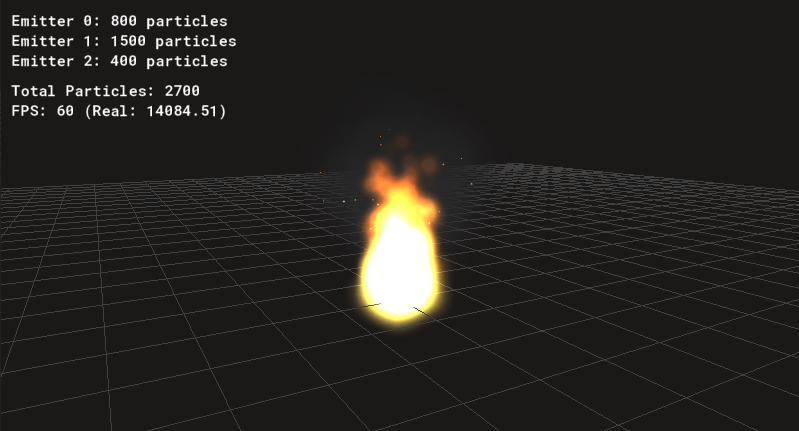

# Unique Particles 🚀
### Ultra-Performant 3D Particle Engine for GameMaker



Unique Particles is a state-of-the-art particle system that offloads 100% of particle simulation, physics, and visual interpolation to the GPU. By using **Circular Persistent Buffers** and a **Time-Based Simulation**, it achieves a near-zero CPU footprint even with tens of thousands of active particles.

---

## 🧬 System Architecture

1. **[UeParticleType](scripts/UeParticleType/UeParticleType.gml)**: The template. Defines visuals, physics, and life ranges.
2. **[UeParticleEmitter](scripts/UeParticleEmitter/UeParticleEmitter.gml)**: The worker. Manages the **Circular Buffer** and decides *when* and *where* to spawn particles.
3. **[UeParticleRenderer](scripts/UeParticleRenderer/UeParticleRenderer.gml)**: The orchestrator. Manages the Vertex Format, Shaders, and Uniforms.
4. **[UeParticleSystem](scripts/UeParticleSystem/UeParticleSystem.gml)**: The manager. Handles LOD, Frustum Culling, and global updates.

---

## 🛠️ UeParticleType API

`UeParticleType` is the core of particle definition. It uses a fluent interface (method chaining) for clear and fast configuration.

### Configuration Methods

- **`.setLife(min, max)`**: Lifetime in seconds.
- **`.setSize(min, max, [incr], [wiggle])`**: Initial size and transformation over time.
- **`.setScale(sx, sy)`**: Set aspect ratio for the particle quad (e.g., for sparks).
- **`.setSpeed(zMin, zMax, [xyMin], [xyMax], [zIncr], [xyIncr], [zWiggle], [xyWiggle])`**: Initial velocity and acceleration (supports 3D).
- **`.setDrag(value)`**: Air resistance (0-1). Slows down particles over time.
- **`.setDirection(min, max, [incr], [wiggle])`**: Movement direction in degrees.
- **`.setGravity(amountZ, [amountXY], [dirXY])`**: Constant gravity applied to particles.
- **`.setColor(color1, [color2])`**: Start and end color (interpolation handled by GPU).
- **`.setAlpha(alpha1, [alpha2])`**: Start and end transparency.
- **`.setAdditive(bool)`**: Enables additive blend mode.
- **`.setSprite(sprite, [subimg])`**: Uses a GameMaker sprite as a texture.
- **`.setShape(name)`**: Uses a pre-defined procedural shape.

### 🎨 Procedural Shapes

The engine automatically generates procedural textures for common effects:

*   **`"point"`**: A solid circular point with slight antialiasing.
*   **`"sphere"`**: A soft particle with radial decay, perfect for smoke, glows, and fire.
*   **`"flare"`**: A cross-flare effect with a bright core, ideal for sparks.
*   **`"square"`**: A solid filled square.
*   **`"box"`**: A hollow square frame.
*   **`"disk"`**: A sharp, flat filled circle.
*   **`"ring"`**: A hollow circular ring with a thick border.
*   **`"smoke"`**: Multi-layered soft noise for volumetric effects.

---

## 🚀 Quick Start

### 1. Simple Configuration
```gml
// Create the system
mySystem = new UeParticleSystem();

// Configure a fire type
fireType = new UeParticleType()
    .setLife(0.5, 1.2)
    .setSpeed(50, 150)
    .setGravity(20) // Z-up gravity
    .setColor(c_yellow, c_red)
    .setAlpha(1.0, 0.0)
    .setAdditive(true);
```

### 2. Multi-Emitter Setup
```gml
// 5000 particle max per emitter
myEmitter = mySystem.addEmitter(new UeParticleEmitter(5000));
myEmitter.region("box", -10, -10, 0, 10, 10, 5);

// Different emission modes
myEmitter.stream(fireType, 100); // 100 particles/sec
myEmitter.burst(sparkType, 50);  // Instant 50 particles
myEmitter.clear();               // Reset emitter
```

---

## 🌪️ Performance & Optimization

The engine is built on high-performance architectural pillars designed for modern 3D games:

### 🚀 GPU-Driven Simulation
- **Analytical GPU Trajectory**: The CPU never calculates positions. It only writes "Birth Data" to a buffer. The Vertex Shader solves the motion equation `p = p0 + v0*t + 0.5*a*t^2` in real-time.
- **Age-Based Auto-Discard**: No CPU-side "killing" of particles. The shader compares `age` to `maxLife`; if it exceeds it, the vertex is discarded, resulting in zero processing for dead particles.

### 💾 Memory & Bandwidth
- **Circular Persistent Buffers**: Uses a `vertex_update_buffer_from_buffer` approach. GML writes vertex data **only once** at spawn. Static emitters cost **zero CPU** on the draw call.
- **Zero-Allocation Model**: Uses fixed-size buffers and pre-allocated arrays, eliminating runtime allocations, memory fragmentation, and GC spikes.
- **Lightweight Layout (52 Bytes)**: To maximize bandwidth, only per-particle data is in vertices, while shared emitter data is passed via **Uniforms**.

### 📐 3D & Visuals
- **Z-Up 3D System**: Designed specifically for 3D GameMaker environments with Z-up coordinates.
- **Analytical Frustum Culling**: Calculates a **Dynamic Culling Sphere** using the physical limits of the particle type.
- **Soft Particles (Ground Fading)**: GPU-side fading when particles intersect with the ground (Z=0), creating a volumetric look for fire and smoke.
- **Distance LOD**: Automatic emission scaling based on camera distance to reduce overdraw and GPU fill-rate pressure.

---
Developed with ❤️ by Emmanuel Di Iorio - MIT License
